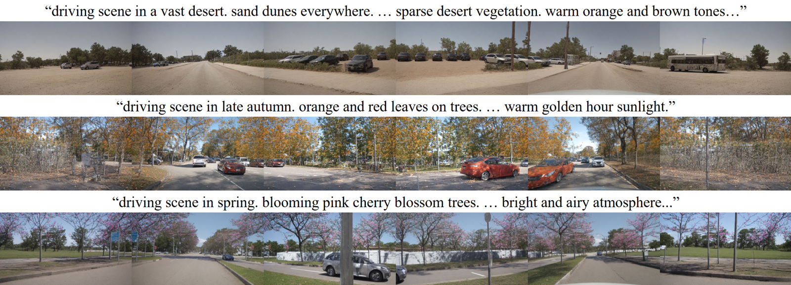

<div align="center">

# FrozenDrive: Zero-Shot Text-Guided Driving Scene Generation and Data Augmentation with Parameter-Free Frozen Diffusion Model

### **ECCV 2026**

**[Yuhwan Jeong](https://jeongyh98.github.io/)\*, [Hyeonseong Kim](https://github.com/hskim617)\*, [Daehyun We](https://github.com/daehyunwe)\*, [Seonkyu Song](https://github.com/ssunkyu)\*, [Jinnyeong Yang](https://github.com/taekbaeajossi)\*, [Hyun-Kurl Jang](https://blue-531.github.io/), [Youngho Yoon](https://yh-yoon.github.io/), [Kuk-Jin Yoon](https://vi.kaist.ac.kr/pages/faculty/)**

KAIST, Visual Intelligence Lab
*\* Indicates Equal Contribution*

<br>

[](https://arxiv.org/abs/2606.20110)
[](https://frozendriveeccv.github.io/)

<br>

<figure style="text-align: center; margin-bottom: 10px;">
  
  <figcaption style="font-size: 14px; color: #666;">Examples of generated images from various text prompts</figcaption>
</figure>

</div>
</div>

**FrozenDrive** is a multi-view video generation framework for autonomous driving that enables **zero-shot text guidance**. It leverages a **parameter-free** strategy while keeping the pretrained diffusion model **frozen**, preserving its knowledge while achieving strong multi-view and temporal consistency.

FrozenDrive supports:

- Multi-view video generation
- Zero-shot text-based control (e.g., "snowy night")
- Data augmentation for autonomous driving


## 📌 Overview
- [🚀 Installation](#-installation)
- [📦 Dataset Preparation](#-dataset-preparation)
- [💾 Pretrained Weights](#-pretrained-weights)
- [🛠️ Training & Inference](#training-inference)
- [📊 Evaluation](#-evaluation)
- [📝 Citation](#-citation)
- [🙏 Acknowledgments](#-acknowledgments)


## 🚀 Installation

All the codes are tested in the following environment:

Linux (tested on Ubuntu 20.04)

CUDA 11.3 or higher

```bash
# Install a virtual environment.
conda create -n frozendrive python=3.9
conda activate frozendrive
conda install -c nvidia/label/cuda-11.3.1 cuda -y
```

Install `nuplan-devkit` from source

```bash
cd WorldDreamer/third_party/nuplan-devkit
pip install -r requirements.txt
pip install -e .
```

Install `Pytorch==1.10.2` and `torchvision==0.11.3`

```bash
pip install torch==1.10.2+cu113 torchvision==0.11.3+cu113 torchaudio==0.10.2+cu113 -f https://download.pytorch.org/whl/cu113/torch_stable.html
```

Install the source code for other third-party packages, with `cd ${FOLDER}; pip install -e .`

```
# Install third-party packages
third_party/
├── bevfusion -> based on db75150
├── diffusers -> based on v0.17.1 (afcca3916)
└── xformers -> minorly change 0.0.19 to install with pytorch1.10.2

# Troubleshooting (No module named 'torch')
pip install "pip<25.3"
```

Install the dependencies of WorldDreamer
```bash
cd WorldDreamer
pip install -r requirements.txt
pip install "huggingface_hub<0.26.0" fastapi uvicorn albumentationsx "numpy<2"
```


## 📦 Dataset Preparation

Currently we provide the dataloader of [nuScenes dataset](#nuscenes-dataset).

### nuScenes Dataset

- Please download the official [nuScenes dataset](https://www.nuscenes.org/download) and organized the files as follows.

  ```
  ${DATASET_ROOT}/nuscenes/
  ├── maps
  ├── samples
  ├── sweeps
  └── v1.0-trainval
  ```
- Install the nuscenes-devkit by running the following command:
  ```shell
  pip install nuscenes-devkit==1.1.11
  ```
- Generate the `ann_file` **(with keyframes / samples)** by running the following command, it may take several hours:
  ```shell
  python -m tools.create_data nuscenes \
  --root-path /path/to/nuscenes --out-dir ./data/nuscenes_mmdet3d-t-keyframes/ \
  --extra-tag nuscenes --only_info
  ```
- Generate the `ann_file` **(with 12hz / sweeps)** by running the following command, it may take longer time. We use them to train the model.
    
    - Firstly, follow [ASAP](https://github.com/JeffWang987/ASAP/blob/main/docs/prepare_data.md) to generate interp annotations for nuScenes. 

        **Note**: The following codes in ASAP need to be modified:
        
        - In `sAP3D/nusc_annotation_generator.py`, please comment [line357](https://github.com/JeffWang987/ASAP/blob/52316629f2a87ef2ef5bbc634d33e9544b5e39a7/sAP3D/nusc_annotation_generator.py#L357), and modify [line101](https://github.com/JeffWang987/ASAP/blob/52316629f2a87ef2ef5bbc634d33e9544b5e39a7/sAP3D/nusc_annotation_generator.py#L101) to `val_scene_ids = splits['val'] + splits['train']`.
        
        - Modify the dataset path in `scripts/ann_generator.sh` to your custom dataset path.
    
        Then, you can run the following command in ASAP root:
        ```
        bash scripts/ann_generator.sh 12 --ann_strategy 'interp' 
        ```
        (Optional) Generate advanced annotations for sweeps. (We do not observe major difference between interp and advanced. You can refer to the implementation of [ASAP](https://github.com/JeffWang987/ASAP/blob/main/docs/prepare_data.md). This step can be skipped.)

        Rename the generated folder to `interp_12Hz_trainval` and move it into your nuScenes dataset root.
        
    - Use the following command to generate ann_file with 12hz.
        ```
        python tools/create_data.py nuscenes \
        --root-path /path/to/nuscenes \
        --out-dir ./data/nuscenes_mmdet3d-12Hz \
        --extra-tag nuscenes_interp_12Hz \
        --max-sweeps -1 \
        --version interp_12Hz_trainval
        ```

- (Optional but recommended) We recommend generating cache files in `.h5` format of the BEV map to speed up the data loading process.
    ```
    # generate map cache for val
    python tools/prepare_map_aux.py +process=val +subfix=12Hz_interp

    # generate map cache for train
    python tools/prepare_map_aux.py +process=train +subfix=12Hz_interp
    ```
    After generating the cache files, move them to `./data/nuscenes_map_aux_12Hz_interp`

- The final data structure should look like this:
    ```
    WorldDreamer/data/
    ├── ...
    ├── nuscenes_mmdet3d-keyframes
    │       ├── nuscenes_infos_train.pkl
    │       └── nuscenes_infos_val.pkl
    ├── nuscenes_mmdet3d-12Hz
    |       ├── nuscenes_interp_12Hz_infos_train.pkl
    |       └── nuscenes_interp_12Hz_infos_val.pkl
    └── nuscenes_map_aux_12Hz_interp  # from interp
            ├── train_200x200_12Hz_interp.h5
            └── val_200x200_12Hz_interp.h5
    ```

### Occupancy Generation
- Run the data preparation step in [UniScene](https://github.com/Arlo0o/UniScene-Unified-Occupancy-centric-Driving-Scene-Generation) to generate ground-truth semantic occupancy via NKSR reconstruction.
- Use `Occupancy/project_uniscene.py` to project semantic occupancy to each camera image plane.
- The resulting depth maps are then used for conditional inputs.


## 💾 Pretrained Weights
We used the pre-trained weights of [stable-diffusion-v1-5](https://huggingface.co/runwayml/stable-diffusion-v1-5) ([backup_link](https://huggingface.co/pt-sk/stable-diffusion-1.5)) and [CLIP-ViT](https://huggingface.co/laion/CLIP-ViT-B-32-laion2B-s34B-b79K).

We assume you put them at `WorldDreamer/pretrained/` as follows:

```
WorldDreamer/pretrained/
        ├── stable-diffusion-v1-5/
        └── CLIP-ViT-B-32-laion2B-s34B-b79K/
```

We provide the pre-trained weights of **FrozenDrive** through huggingface [link](https://huggingface.co/daehyunwe/frozendrive). Please download them into `WorldDreamer/dreamer-log/SDv1.5_mv_single_ref_nus`, as follows:
```
WorldDreamer/dreamer-log/
        └── SDv1.5_mv_single_ref_nus
                ├── hydra
                └── weight-E5-S200000
```


<a id="training-inference"></a>
## 🛠️ Training & Inference
### Train
- Run the following command to initiate 2 stage training.
  ```bash
  bash scripts/train_lr2hr.sh
  ```

### Inference
- Run the following command to test with pretrained weights.
  ```bash
  bash scripts/test_occ.sh
  ```
  Generate with various text prompts by changing `+text_prompt={}` in the command. For example,
  ```
  python tools/test_occ.py \
    --config-name=${CONFIG} \
    log_root_prefix=./dreamer-log/test \
    resume_from_checkpoint=${CHECKPOINT} \
    runner=default \
    +text_prompt="Rainy weather. Heavy rain. Wet surface."
  ```


## 📊 Evaluation
### Preparation
- First, split images by camera.
  ```bash
  python tools/image_splitter.py
  ```
- Then upscale images into 1600x900 with bilinear interpolation.
  ```bash
  python DrivingAgents/UniAD/demo/uniad_interp.py
  ```
- Finally, group images by scene.
  ```bash
  python tools/image_grouper.py
  ```

### FVD
- Follow [FVD](https://github.com/songweige/TATS.git) for environment setup and downloading checkpoints. Run the following command to evaluate FVD.
  ```bash
  cd TATS
  bash scripts/fvd.sh
  ```
  The first run will take some time since it computes and caches the embeddings for ground-truth NuScenes clips.

### UniAD perception and planning metrics.
- Follow [UniAD](https://github.com/OpenDriveLab/UniAD.git) for environment setup and downloading checkpoints. Run the following command to evaluate perception and planning metrics.
  ```bash
  cd DrivingAgents/UniAD
  ./tools/uniad_dist_eval.sh ./projects/configs/stage2_e2e/base_e2e_drivearena.py ./ckpts/uniad_base_e2e.pth 1
  ```


## 📝 Citation
```bibtex
@article{jeong2026frozendrive,
  title={FrozenDrive: Zero-Shot Text-Guided Driving Scene Generation and Data Augmentation with Parameter-Free Frozen Diffusion Model},
  author={Jeong, Yuhwan and Kim, Hyeonseong and We, Daehyun and Song, Seonkyu and Yang, Jinnyeong and Jang, Hyun-Kurl and Yoon, Youngho and Yoon, Kuk-Jin},
  journal={arXiv preprint arXiv:2606.20110},
  year={2026}
}
```


## 🙏 Acknowledgments

This work builds on the following research project.

[DriveArena: A Closed-loop Generative Simulation Platform for Autonomous Driving](https://github.com/PJLab-ADG/DriveArena).

```bibtex
@inproceedings{yang2025drivearena,
  title={Drivearena: A closed-loop generative simulation platform for autonomous driving},
  author={Yang, Xuemeng and Wen, Licheng and Wei, Tiantian and Ma, Yukai and Mei, Jianbiao and Li, Xin and Lei, Wenjie and Fu, Daocheng and Cai, Pinlong and Dou, Min and others},
  booktitle={Proceedings of the IEEE/CVF International Conference on Computer Vision},
  pages={26933--26943},
  year={2025}
}
```
